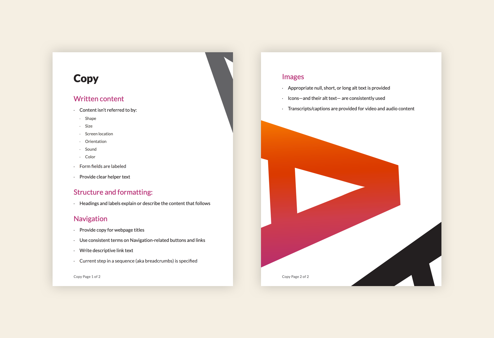

### Challenge

Take nearly two decades of code, content, and designs that weren’t created with accessibility in mind, and create a process that would lead to AA compliance based on the Web Content Accessibility Guidelines (WCAG).

But the WCAG is 80+ rules of jargon and difficult-to-understand rules.

### Solution

Make it easy.

Instead of putting the work and accessibility responsibility solely on devs and QA, we decided to let each craft do their part to build accessible products.

### How I helped

- Rewrote the WCAG rules
- Grouped the relevant ones per discipline

### Team

- <a href="https://www.linkedin.com/in/tylercramsey/" rel="noopener noreferrer" target="_blank">Tyler Ramsey</a>, Visual Designer
- <a href="https://www.linkedin.com/in/rochellet/" rel="noopener noreferrer" target="_blank">Rochelle Turner</a>, QA Manager
- <a href="https://www.linkedin.com/in/nicoleely/" rel="noopener noreferrer" target="_blank">Nicole Ely</a>, QA Engineer
- <a href="https://www.linkedin.com/in/alicemhahn/" rel="noopener noreferrer" target="_blank">Alice Hahn</a>, UX Designer
- <a href="https://www.linkedin.com/in/danipach/" rel="noopener noreferrer" target="_blank">Danielle Pacheco</a>, UX Designer
- <a href="https://www.linkedin.com/in/sarajeancodes/" rel="noopener noreferrer" target="_blank">Sara Deenanauth</a>, Software Engineering Manager
- <a href="https://www.linkedin.com/in/adileneconstante/" rel="noopener noreferrer" target="_blank">Adilene Constante</a>, Front End Engineer
- <a href="https://www.linkedin.com/in/bphillips201/" rel="noopener noreferrer" target="_blank">Brian Phillips</a>, Front End Engineering Manager

### Process

I went through all 80 rules, pulled out the ones that were AA specific, and gave them to each discipline rep.

They rewrote the rules in their craft’s “language,” and I went through the final lists and copyedited them (and I was the copy rep).

From there, we had checklists for each discipline (design, content, dev, and QA) to follow.

### Recommendations

- Group and condense the rules
- Rewrite the rules and make them clearer

### Outcome

Increased accessibility awareness across the org and an easier way to build more accessible products

<small><em>Click image to expand</em></small>

