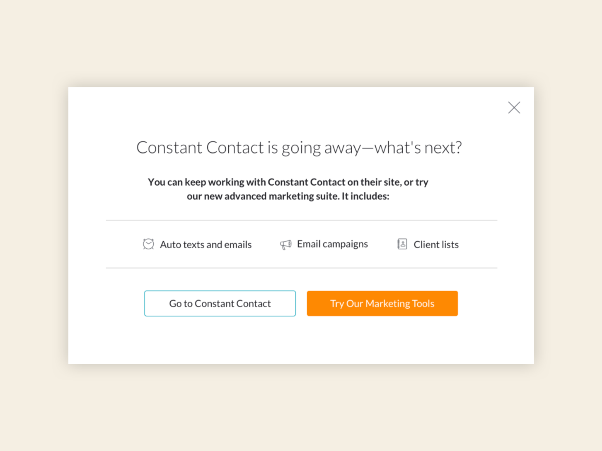
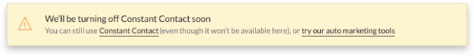

### Challenge

Migrate existing customers using Constant Contact's integration and onboard new customers onto MINDBODY’s email campaign feature.

### Solution

Using an email, modal, and alert banner, inform customers that Constant Contact’s integration is being removed.

### How I helped

- Message development
- Collaboration with team members in other departments (Customer Support and Product Marketing)

### Team

- <a href="https://www.linkedin.com/in/alexis-elan-ross/" rel="noopener noreferrer" target="_blank">Alexis Ross</a>, Visual Designer
- <a href="https://www.linkedin.com/in/heysaralancaster/" rel="noopener noreferrer" target="_blank">Sara Lancaster</a>, UX Designer
- <a href="https://www.linkedin.com/in/marianneconner/" rel="noopener noreferrer" target="_blank">Marianne Connor</a>, Researcher
- <a href="https://www.linkedin.com/in/rmdougal/" rel="noopener noreferrer" target="_blank">Ryan Dougal</a>, Product Marketing Manager

### Process

There were two groups of customers: those using Constant Contact and those not using any type of email marketing. I worked with Product Marketing to tailor the messaging that would help both groups feel supported in their choice: whether to keep using Constant Contact without our integration or start using MINDBODY’s similar tools.

### Recommendations

- Collaborate with Product Marketing to align on message value props
- Create a sense of urgency without getting in the customer's way. They still needed to run their business and were already familiar with Constant Contact. We needed to explain the situation and their options while giving them time to make a decision.

### Outcome

**Helpful messaging that informed users about their options without pushing them to upgrade. No dark patterns here.**

We decided on an email, an FTU modal, and two alert banners (one on their dashboard and the second in their reports).

### Modal

<small><em>Click image to expand</em></small>

### Banners

The first alert lets users know when their features would be unavailable.

The second alert was the last chance for users to make a decision.

<small><em>Click images to expand</em></small>

