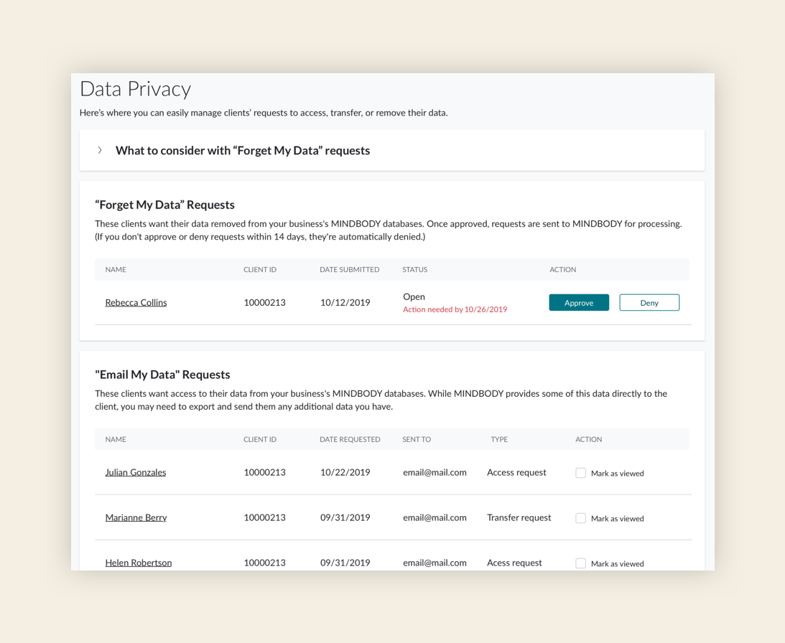

### Challenge

California Consumer Privacy Act (CCPA) went into effect on January 1, 2020. According to Security Intelligence, “Focusing on the rights of California residents, this legislation protects data privacy and helps individuals understand what data is collected and how it is sold or disclosed. Any organization interacting with Californians needs to comply.”

The process of keeping up with data privacy requests is manual for MINDBODY employees. Customer support has to track, manage, and communicate the requests to the corresponding businesses and internal MB teams for processing—taking over 40 hours of support each month. Legal identified this inefficiency as a risk.

### Solution

Client-facing: Use the content already provided for the GDPR requirements

Customer-facing: Build a page for them to easily track and manage their clients’ data requests

### How I helped

- Taxonomy and grouping
- Information architecture
- Content strategy

### Team

- <a href="https://www.linkedin.com/in/heysaralancaster/" rel="noopener noreferrer" target="_blank">Sara Lancaster</a>, UX Designer
- <a href="https://www.linkedin.com/in/rmdougal/" rel="noopener noreferrer" target="_blank">Ryan Dougal</a>, Product Marketing Manager
- <a href="https://www.linkedin.com/in/chinweobi/" rel="noopener noreferrer" target="_blank">Chinwe Obi</a>, Researcher

### Process

With a tight deadline, we had to cut corners. Developers decided to reuse an existing table component; Sara and I decided to simplify and reorganize the content.

The majority of the work was content-related: figuring out what content to include, alerting users about new requests, and creating instructions to help them understand this new business responsibility.

### Recommendations

- Use the same terminology for the new customer-facing content as we did for the client-facing content
  - Consistency will help customer support whenever customers call in for help
- Link the client’s name to their personal page to see more details (if they owe money, have unused classes, etc.)

### Outcome

We met 2 of 3 of our KPIs:

- Mitigate legal risk
  - We did it!
  - Customer support’s manual steps for redaction requests were reduced by 50%.
- Provide customers with data privacy tools
  - We did it!
  - 25% of approvals/denials have been through the data privacy management page we built
- Save customer support team time (go from 7 minutes per request to 5 minutes)
  - We didn’t do it.
  - We need to reevaluate staff permissions.

<small><em>Click image to expand</em></small>

