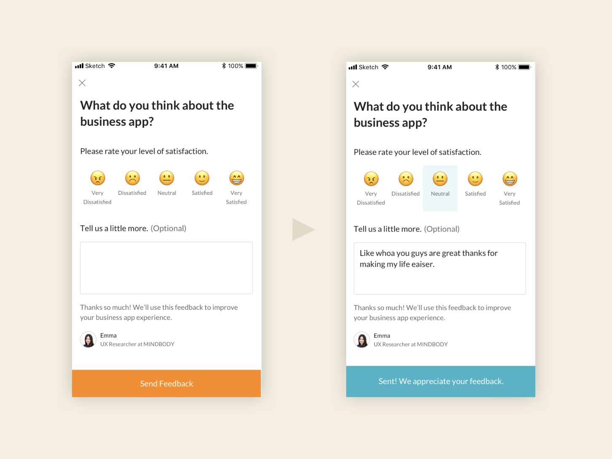

### Challenge

Encourage customers to share honest, actionable feedback about their app experience

### Solution

Create an in-app feedback survey (presented as a modal) that's easy and delightful to use. Then, build a repository of the info gathered to use as research for future projects.

### How I helped

- Content strategy and plain language writing
- Message development
- Information architecture
- Taxonomy and grouping

### Team

- <a href="https://www.linkedin.com/in/kitfrench/" target="_blank">Kit French</a>, Visual Designer
- <a href="https://www.linkedin.com/in/katcordio/" target="_blank">Kathryn Cordio</a>, UX Designer
- Emma Tietje, Researcher

### Process

After researching other apps' feedback features, Kit, the visual designer, and I worked through several design iterations. Emma, the researcher, and I decided which questions we wanted to ask and how to best phrase them so we weren’t leading the customers.

### Recommendations

- Keep it short and simple—don’t ask more than two questions
- Don’t make the long-form field required
- Include a photo of the researcher, so customers know their responses are getting read by a human and therefore worth filling out the survey

### Outcome

**So many responses**

The feedback modal has been one of the most popular additions to our app! We received over 400 replies within the first few weeks of release without even marketing the survey's existence.

### Workflow with success message

<small><em>Click image to expand</em></small>

