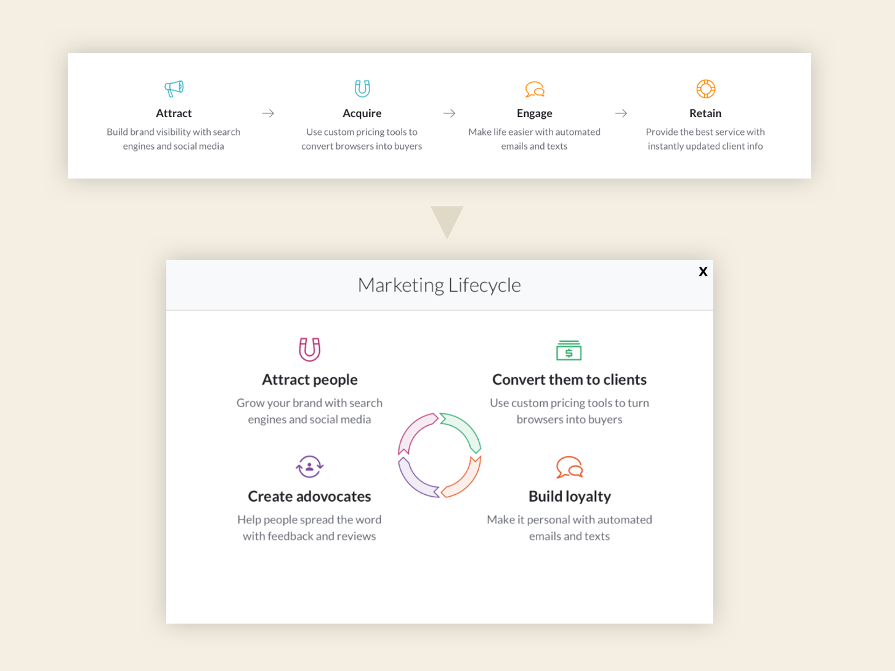

### Challenge

Help people understand where to focus their marketing efforts and which tools to set up, so they can reach their goals

### Solution

Develop a streamlined, relevant version of the marketing lifecycle based on MINDBODY’s customers’ needs

### How I helped

- Content strategy and plain language writing
- Message development
- Information architecture

### Team

- <a href="https://www.linkedin.com/in/alexis-elan-ross/" rel="noopener noreferrer" target="_blank">Alexis Ross</a>, Visual Designer
- <a href="https://www.linkedin.com/in/heysaralancaster/" rel="noopener noreferrer" target="_blank">Sara Lancaster</a>, UX Designer
- <a href="https://www.linkedin.com/in/marianneconner/" rel="noopener noreferrer" target="_blank">Marianne Connor</a>, Researcher
- <a href="https://www.linkedin.com/in/rmdougal" rel="noopener noreferrer" target="_blank">Ryan Dougal</a>, Product Marketing Manager

### Process

Battling the “too many to choose from” disease, I worked with product marketing, visual and UX design to help people understand which tools are available, which they need to set up, and which they can use if they upgrade. I worked with Alex, the visual designer, to shape where the messaging should live and with UX designer, Sara, to decide how to introduce the new element, how it should be interacted with.

### Recommendations

Find a balance between using precise language and user-focused explanations.

For example, I recommended things like:

- Use little to no marketing language (we didn’t need to pitch to the user)
- Use less MINDBODY jargon
- Don’t interrupt their flow with a modal

### Outcome

**More educational content to guide people through getting and keeping customers.**

I was happy with the collaboration process. Once we agreed on the language choices, we were able to implement it throughout the rest of the page. There were a lot of cooks in the kitchen on this small addition to the webpage, but we were able to reach a happy compromise.

<small><em>Click image to expand</em></small>

