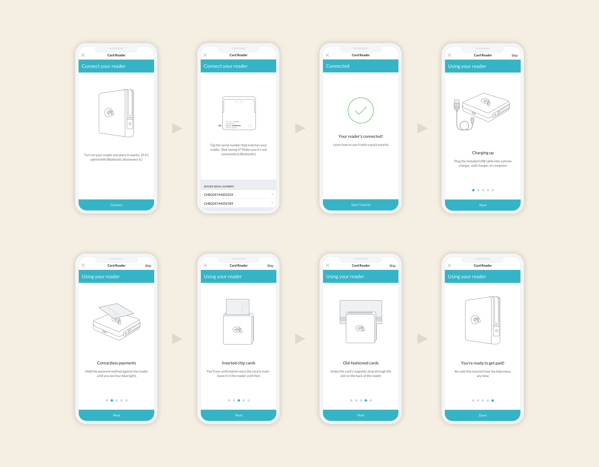
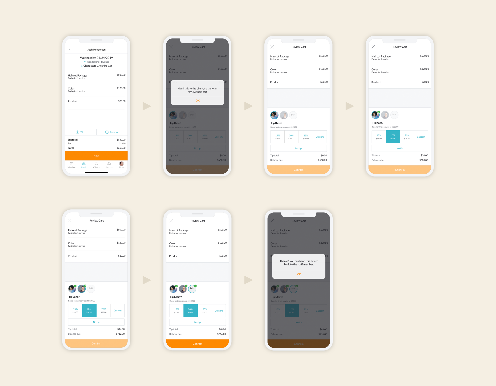

### Challenge

Introduce a new mobile point-of-sale device—the BBPOS Chipper—and provide separate “connect” and “collect” workflows.

Create an easier, more private way for customers to tip, and work with Legal to ensure we’re meeting California’s requirements.

### Solution

Minimally update the current “collect” workflow to limit change aversion drop-offs, eliminate and/or combine a few screens to limit the number of taps (a big complaint among users) to get through the experience.

### How I helped

- Guerrilla testing
- Message development and content strategy (specifically around tipping)
- Information architecture
- Taxonomy and grouping

### Team

- <a href="https://www.linkedin.com/in/laura-ziegler/" rel="noopener noreferrer" target="_blank">Laura Ziegler</a>, Visual Designer
- Emma Tietje, Researcher

### Process

One word: iteration.

Laura and I worked very closely with the developers since there were significant legacy issues—what code is changeable? Which screens need an error state or microcopy? How can we make this experience simpler? What has to stay because of legal requirements?

The customer’s cart had to be reviewable before payment request, which required moving the tipping request in the flow.

### Recommendations

- Simplify content
- Use consistent terms
- Defer to platform styles
- Reorder screens
- Condense button copy to one-word CTAs
- Reduce the number of times the device is being handed between a staff member and customer

### Outcome

More educational content to guide people through getting and keeping customers.

Total sales transactions have increased by 7% since the new tipping version rolled out (October 2019–December 2019).

As of January 2020, the app is processing an average of \$692,000 each month through the mobile checkout experience.

See it live on the <a href="https://apps.apple.com/us/app/id599125654" rel="noopener noreferrer" target="_blank">MINDBODY business app</a>.

<small><em>Click images to expand</em></small>

