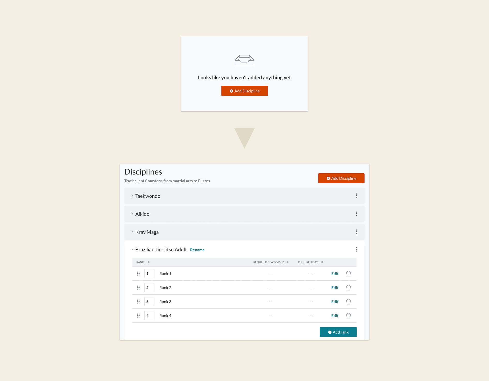

### Challenge

At the beginning of 2020, Mindbody had 320 martial arts customers, but our software wasn't created with their needs in mind.

Build an interface specifically for martial arts customers to manage their clients. Surprise twist: make it general, too. Any studio that offers progression-based classes (fitness challenges, aerial arts, barre, etc.) should also be able to use the new UX.

### Solution

Imitate the manual process studio owners use to track their clients and translate that into a digital environment.

### How I helped

- Information architecture
- Taxonomy and labeling

### Team

- <a href="https://www.linkedin.com/in/nathandominguez/" rel="noopener noreferrer" target="_blank">Nathan Dominguez</a>, UX Designer
- <a href="https://www.linkedin.com/in/micah-entrekin-9328262b/" rel="noopener noreferrer" target="_blank">Micah Entrekin</a>, Product Designer
- <a href="https://www.linkedin.com/in/chinweobi/" rel="noopener noreferrer" target="_blank">Chinwe Obi</a>, Researcher

### Process

Learn more about martial arts—what does the language look like?—and find out how our customers hack our software to make it work for their business.

I worked closely with research and our internal teams to get the inside scoop on the vocabulary of both martial arts customers and nontraditional fitness studios to find where their languages intersected. _What words do they both use? What would make sense for any martial arts disciplines (because they're all different) AND pilates, silks, and aerial studios?_

### Outcome

Mindbody deprioritized this project after COVID-19.

<small><em>Click images to expand</em></small>

