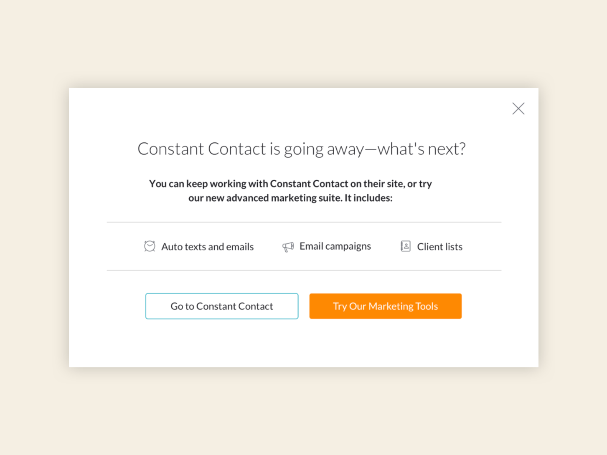

### Challenge

Migrate existing customers using Constant Contact's integration and onboard new customers onto MINDBODY’s similar email campaign feature.

### Solution

Inform customers in phases that Constant Contact’s integration is being removed with an email, modal, and alert banners.

### How I helped

- Message development
- Collaboration between team members in other departments (support and product marketing)

### Team

- <a href="https://www.linkedin.com/in/alexis-elan-ross/" target="_blank">Alexis Ross</a>, Visual Designer
- <a href="https://www.linkedin.com/in/heysaralancaster/" target="_blank">Sara Lancaster</a>, UX Designer
- <a href="https://www.linkedin.com/in/marianneconner/" target="_blank">Marianne Connor</a>, Researcher
- <a href="https://www.linkedin.com/in/rmdougal/" target="_blank">Ryan Dougal</a>, Product Marketing Manager

### Process

There were two groups of customers: those using Constant Contact and those who weren’t using any type of email marketing. I worked with product marketing to tailor the messaging that would help customers feel supported in either choice: to keep using Constant Contact (just not with our integration) or start using MINDBODY’s similar tools.

### Recommendations

Collaborate with product marketing, Create a sense of urgency (so customers would take action) but don’t get in their way. They still needed to run their business and were used to the Constant Contact functionality—tell them what to expect with plenty of time to make an educated decision.

### Outcome

**Helpful messaging that informed users about their options without pushing them to upgrade for the sake of it.**

We decided on an initial email, an FTU modal, and two alert banners (one on their dashboard and the second in their reports).

### Modal

<small><em>Click image to expand</em></small>

### Banners

The first alert lets users know when their features would be unavailable.

The second alert was the last chance for users to make a decision.

<small><em>Click images to expand</em></small>

