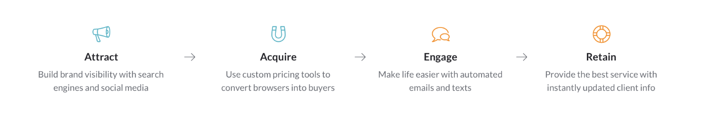

## Challenge

Help people understand where to focus their marketing efforts and which tools to set up, so they can reach their goals

## Solution

Develop a streamlined, relevant version of the marketing lifecycle based on MINDBODY’s customers’ needs

## How I helped

- Content strategy and plain language writing
- Message development
- Information architecture

###Team:

- Alex Ross, visual designer
- Sara Lancaster, UX designer
- Marianne Connor, researcher

## Process

Battling the “too many to choose from” disease, I worked with product marketing, visual and UX design to help people understand which tools are available, which they need to set up, and which they can use if they upgrade. I worked with visual to shape where the messaging should live and with UX design to decide how to introduce the new element.

## Recommendations

Find a balance between using precise language and user-focused explanations

For example, I recommended things like:

- Use little to no marketing language (we didn’t need to pitch to the user)
- Use less MINDBODY jargon
- Don’t interrupt their flow with a modal

## Outcome

**More educational content to guide people through getting and keeping customers.**
I was happy with the collaboration process. There were a lot of cooks in the kitchen on this small addition to the webpage, but we were able to reach a compromise.

